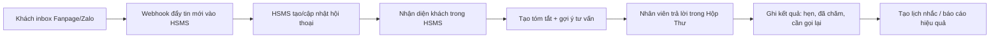

# Quy hoạch Module Marketing HSMS

Cập nhật: 13/06/2026

## Mục tiêu

Marketing trong HSMS không chỉ là chạy quảng cáo. Đây là trung tâm gom toàn bộ tương tác khách hàng từ Fanpage, Zalo, hotline, POS, lịch hẹn, thẻ liệu trình và báo cáo nhân viên để biến thành việc cụ thể mỗi ngày:

- Trả lời khách nhanh hơn.
- Nhận diện khách cũ/khách mới ngay trong lúc chat.
- Gợi ý cho nhân viên nên tư vấn gì, nên bán thêm gì.
- Theo dõi khách đã đến spa, phản hồi ra sao, kỹ thuật viên phục vụ thế nào.
- Nhắc khách quay lại đúng chu kỳ dịch vụ.
- Đo hiệu quả Fanpage, bài viết, chiến dịch và nhân viên tư vấn.

## Nguyên tắc thiết kế

1. Không để nhân viên nhìn dữ liệu thô.
   Dữ liệu thô dùng cho hệ thống phân tích; nhân viên chỉ nhìn việc cần làm, lịch sử cần biết và gợi ý trả lời.

2. Chat là trung tâm vận hành.
   Khi khách đang inbox, nhân viên phải thấy hội thoại, hồ sơ HSMS, lịch sử mua, thẻ còn buổi và đề xuất tư vấn trong cùng màn hình.

3. Realtime phải dùng webhook.
   Không kéo lại toàn bộ tin nhắn Fanpage mỗi lần. Khách nhắn tới thì Meta/Zalo đẩy tin mới vào HSMS, HSMS chỉ lưu phần mới và cập nhật tóm tắt.

4. Dữ liệu dài phải được tóm tắt.
   Tin nhắn cũ nhiều năm không thể bắt nhân viên đọc thủ công. Hệ thống giữ 20-50 tin gần nhất, tóm tắt nhu cầu, dịch vụ quan tâm, lịch hẹn, phản hồi, khiếu nại và điểm cần chú ý.

5. Marketing phải nối với POS.
   Một khách inbox không chỉ là một cuộc chat. Đó có thể là khách đã mua thẻ, còn liệu trình, lâu chưa đến, hoặc từng phản hồi không hài lòng.

## Menu cha đề xuất

Menu cha: **Marketing**

Các menu con:

1. Tổng Quan Marketing
2. Hộp Thư Khách Hàng
3. Fanpage & Nội Dung
4. Khách Hàng Tiềm Năng
5. Chăm Sóc Sau Dịch Vụ
6. Nhắc Lịch Liệu Trình
7. Chiến Dịch & Remarketing
8. Báo Cáo Nhân Viên Tư Vấn
9. Cấu Hình Kênh

## 1. Tổng Quan Marketing

Mục đích:
Cho anh Nam nhìn nhanh hôm nay hệ thống marketing đang khỏe hay yếu.

Người dùng:
Chủ/quản lý.

Hiển thị chính:

- Tin nhắn mới hôm nay.
- Tin chưa trả lời.
- Thời gian phản hồi trung bình.
- Số khách có thể chốt lịch.
- Số khách đã đặt hẹn từ chat.
- Số khách đã đến spa từ chat.
- Doanh thu gắn được với Fanpage/Zalo/chiến dịch.
- Bài viết đang có tương tác tốt.
- Nhân viên nào xử lý tốt/chậm/bỏ sót.

Nguồn dữ liệu:

- Fanpage inbox/comment.
- Zalo OA sau này.
- POS `don_hang`.
- Khách hàng `khach_hang`.
- Nhật ký chăm sóc `nhat_ky_khach_den`.
- Chi phí marketing.

## 2. Hộp Thư Khách Hàng

Mục đích:
Thay thế việc nhân viên phải mở Fanpage riêng, Zalo riêng, rồi tự nhớ khách.

Người dùng:
Lễ tân, nhân viên tư vấn, quản lý.

Bố cục chuẩn:

- Cột trái: danh sách hội thoại.
- Ở giữa: khung chat realtime.
- Cột phải: hồ sơ khách + đề xuất tư vấn.

Tính năng:

- Nhận tin nhắn Fanpage realtime qua Meta Webhook.
- Gửi tin nhắn từ HSMS.
- Hiện 20-50 tin gần nhất.
- Có nút xem thêm lịch sử.
- Tóm tắt hội thoại dài.
- Nhận diện khách bằng SĐT/Facebook ID/Zalo ID.
- Nếu có hồ sơ HSMS: hiện lịch sử mua, thẻ còn buổi, lần cuối đến.
- Nếu chưa có hồ sơ: gợi ý xin SĐT hoặc tạo khách mới.
- Gợi ý trả lời theo ngữ cảnh.
- Gợi ý upsell/cross-sale.
- Gắn trạng thái: chưa trả lời, đang tư vấn, đã hẹn, đã đến, không liên hệ được, cần quản lý xử lý.
- Ghi kết quả chăm sóc ngay từ khung chat.

Luồng vận hành:



## 3. Fanpage & Nội Dung

Mục đích:
Quản trị sức khỏe Fanpage và kế hoạch bài viết, không chỉ đọc inbox.

Người dùng:
Chủ/quản lý, người phụ trách nội dung.

Tính năng:

- Theo dõi bài viết gần đây.
- Số comment, inbox, tương tác, khách tiềm năng tạo ra từ từng bài.
- Bài nào kéo nhiều khách hỏi giá.
- Bài nào kéo nhiều khách đặt hẹn.
- Bài nào chỉ có tương tác thấp.
- Lịch đăng bài.
- Ý tưởng bài viết theo dịch vụ: gội dưỡng sinh, da, triệt lông, massage, phun xăm.
- Kho nội dung mẫu: bài bán hàng, bài chăm sóc khách cũ, bài feedback, bài ưu đãi.
- Cảnh báo: lâu chưa đăng bài, bài quảng cáo nhiều comment nhưng ít inbox, bài có khiếu nại/comment xấu.

Kết quả cần tạo:

- Kế hoạch post tuần/tháng.
- Đề xuất bài nên chạy quảng cáo.
- Đề xuất nội dung nên lặp lại.
- Báo cáo bài viết hiệu quả.

## 4. Khách Hàng Tiềm Năng

Mục đích:
Gom khách từ inbox/comment/quảng cáo thành nhóm rõ ràng để chăm.

Người dùng:
Quản lý, lễ tân.

Nhóm khách:

- Khách mới hỏi giá.
- Khách muốn đặt hẹn.
- Khách có SĐT nhưng chưa đến.
- Khách chưa có SĐT.
- Khách cũ quay lại hỏi.
- Khách phàn nàn/cần quản lý xử lý.
- Khách tương tác thấp chỉ để remarketing.

Tính năng:

- Tự phân loại.
- Tự gắn điểm ưu tiên.
- Tự gợi ý việc cần làm.
- Chuyển khách sang hộp thư để tư vấn.
- Gắn vào hồ sơ HSMS nếu có SĐT.
- Tạo khách mới nếu chưa có.

## 5. Chăm Sóc Sau Dịch Vụ

Mục đích:
Thay form báo cáo rời rạc của nhân viên bằng dữ liệu có cấu trúc.

Người dùng:
Lễ tân, quản lý, KTV khi cần.

Nhân viên cần nhập:

- Khách nào đã đến hôm nay.
- SĐT.
- Dịch vụ đã dùng.
- KTV phục vụ.
- Khách phản hồi thế nào.
- Khách quan tâm thêm dịch vụ gì.
- Có cơ hội bán thêm không.
- Có vấn đề cần quản lý xử lý không.

Hệ thống tự làm:

- Nối khách với HSMS.
- Cập nhật hồ sơ khách.
- Tạo lịch nhắc chăm lại.
- Đưa khách vào nhóm upsell phù hợp.
- Đưa dữ liệu vào báo cáo nhân viên.

## 6. Nhắc Lịch Liệu Trình

Mục đích:
Không để khách còn thẻ/liệu trình bị quên.

Người dùng:
Lễ tân, quản lý.

Quy tắc gợi ý ban đầu:

- Triệt lông: nhắc khách theo chu kỳ liệu trình, ưu tiên khách còn buổi.
- Da: nhắc chăm sóc lại theo chu kỳ phù hợp từng dịch vụ.
- Gội dưỡng sinh/massage: nhắc lại khách cũ theo tần suất 30-45 ngày.
- Thẻ còn 1-2 buổi: gợi ý gia hạn/mua gói mới.
- Khách lâu không đến 45-90 ngày: mời quay lại bằng ưu đãi khách cũ.

Tính năng:

- Danh sách khách cần nhắc hôm nay.
- Lý do cần nhắc.
- Kịch bản nhắn/gọi.
- Trạng thái: đã nhắn, đã gọi, đã hẹn, không nghe, tạm dừng.
- Tự chuyển khách sang hộp thư nếu họ trả lời.

## 7. Chiến Dịch & Remarketing

Mục đích:
Biến dữ liệu khách thành tệp chăm sóc và chiến dịch cụ thể.

Người dùng:
Chủ/quản lý.

Tính năng:

- Tạo nhóm khách remarketing:
  - Khách từng hỏi triệt lông.
  - Khách từng hỏi da.
  - Khách còn thẻ.
  - Khách lâu chưa quay lại.
  - Khách có SĐT nhưng chưa đến.
  - Khách từng đặt hẹn nhưng không đến.
- Kế hoạch chăm sóc từng nhóm.
- Nội dung mẫu cho từng nhóm.
- Theo dõi kết quả: gửi bao nhiêu, phản hồi bao nhiêu, đặt hẹn bao nhiêu, đến spa bao nhiêu, doanh thu bao nhiêu.

## 8. Báo Cáo Nhân Viên Tư Vấn

Mục đích:
Quản lý được nhân viên tư vấn, không để khách tự trôi.

Người dùng:
Chủ/quản lý.

Chỉ số:

- Số hội thoại đã xử lý.
- Số khách chưa trả lời.
- Thời gian phản hồi trung bình.
- Số khách đặt hẹn.
- Số khách thực tế đến spa.
- Số khách mua thêm/gia hạn.
- Số khách cần chăm lại.
- Phản hồi khách theo KTV.
- Nhân viên có ghi nhật ký đầy đủ không.

Kết quả:

- Biết ai làm tốt.
- Biết ai chỉ trả lời cho có.
- Biết khung giờ nào bỏ sót khách.
- Biết nhóm dịch vụ nào tư vấn yếu.

## 9. Cấu Hình Kênh

Mục đích:
Nơi quản lý kết nối kỹ thuật, không để lẫn vào màn hình vận hành.

Kênh:

- Facebook Page.
- Instagram sau này nếu cần.
- Zalo OA.
- Hotline/tổng đài.
- Website chat sau này.

Tính năng:

- Trạng thái kết nối.
- Token/secret lưu an toàn.
- Webhook health.
- Lần sync cuối.
- Lỗi gần nhất.
- Bật/tắt kênh.
- Quy tắc phân công nhân viên.
- Quy tắc giờ làm việc.
- Kịch bản trả lời ngoài giờ.

## Kiến trúc dữ liệu đề xuất

Các bảng/vùng dữ liệu cần có về lâu dài:

- `marketing_channels`: cấu hình từng kênh.
- `customer_conversations`: một hội thoại với khách.
- `conversation_messages`: tin nhắn hoạt động, có index nhẹ.
- `conversation_summaries`: tóm tắt hội thoại dài.
- `customer_identities`: nối Facebook/Zalo/SĐT với `khach_hang`.
- `care_tasks`: việc cần chăm hôm nay.
- `care_events`: lịch sử nhân viên chăm sóc.
- `content_posts`: bài viết Fanpage/Zalo.
- `content_calendar`: lịch đăng bài.
- `campaigns`: chiến dịch/remarketing.
- `campaign_results`: kết quả chiến dịch.

## Lộ trình triển khai

### Giai đoạn 1: Làm inbox Facebook dùng được thật

- Tạo schema hội thoại nhẹ.
- Tạo Meta Webhook nhận tin nhắn realtime.
- Hộp thư 3 cột: danh sách, chat, hồ sơ/đề xuất.
- Gửi tin từ HSMS.
- Tóm tắt hội thoại.
- Ghi kết quả chăm sóc.

### Giai đoạn 2: Nối sâu với HSMS/POS

- Nhận diện khách bằng SĐT/Facebook ID.
- Hiện lịch sử mua, thẻ còn buổi, lần cuối đến.
- Gợi ý tư vấn theo dịch vụ và lịch sử.
- Tạo lịch nhắc chăm lại sau khi khách đến.

### Giai đoạn 3: Báo cáo nhân viên và chăm sóc sau dịch vụ

- Form nhật ký khách đến chuẩn.
- Báo cáo theo nhân viên.
- Báo cáo theo KTV/phản hồi khách.
- Danh sách khách cần gọi lại theo chu kỳ.

### Giai đoạn 4: Fanpage & nội dung

- Đo hiệu quả bài viết.
- Lịch đăng bài.
- Gợi ý chủ đề post.
- Gắn bài viết với inbox/đặt hẹn/doanh thu nếu có dữ liệu.

### Giai đoạn 5: Zalo và hotline

- Kết nối Zalo OA.
- Chuẩn hóa khách Zalo vào cùng hộp thư.
- Kết nối tổng đài/hotline nếu có nhà cung cấp hỗ trợ webhook/call log.

## Menu đề xuất cuối cùng

```text
Marketing
├── Tổng Quan
├── Hộp Thư Khách Hàng
├── Fanpage & Nội Dung
├── Khách Hàng Tiềm Năng
├── Chăm Sóc Sau Dịch Vụ
├── Nhắc Lịch Liệu Trình
├── Chiến Dịch & Remarketing
├── Báo Cáo Nhân Viên
└── Cấu Hình Kênh
```

## Kết luận

Module này phải được xem là một hệ thống vận hành khách hàng đa kênh, không phải một bảng Marketing đơn lẻ.

Việc ưu tiên đúng nhất là làm **Hộp Thư Khách Hàng realtime cho Facebook** trước, vì đây là nơi khách đang phát sinh mỗi ngày. Khi inbox chạy đúng, các phần còn lại như chăm sóc sau dịch vụ, nhắc lịch liệu trình, báo cáo nhân viên, nội dung Fanpage và remarketing sẽ có dữ liệu thật để phát triển tiếp.
