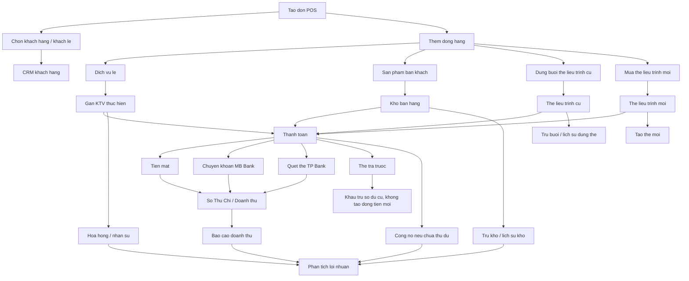

# POS Data Flow Blueprint

> Tai lieu nay ve duong di du lieu thuc te cua HSMS. POS khong chi la man hinh thanh toan; POS la truc dong bo giua khach hang, nhan su, so thu chi, kho, the lieu trinh, cong no, CRM va bao cao.

## Nguyen tac chung

HSMS se hoc cach MySpa tao mot luong van hanh lien mach:

1. Tao don tai quay.
2. Gan khach hang hoac khach le.
3. Ghi nhan khach hom nay lam dich vu gi, mua gi, dung the nao.
4. Gan KTV/nhan su thuc hien hoac nhan vien ban the.
5. Thu tien theo 4 PTTT cua Hannah Spa.
6. Dong bo So Thu Chi, kho, cong no, the lieu trinh, CRM va bao cao.

Khac MySpa, HSMS phai quan ly them chi phi, loi nhuan, kho tieu hao va dong tien that cua Hannah Spa.

## So do du lieu tong quat

## Duong di du lieu khi chot don that

### 1. Don hang

Bang chinh:

- `don_hang`
- `don_hang_chi_tiet`
- `thanh_toan`

Trang thai:

- `draft`: don dang tao hoac luu nhap.
- `da_thanh_toan`: thu du.
- `no_mot_phan`: con no va co ho so khach hang.
- `huy`: don da huy.

### 2. Khach hang va CRM

Khi don that duoc chot:

- Cap nhat `khach_hang.tong_chi_tieu`.
- Tang `khach_hang.so_lan_den`.
- Cap nhat `khach_hang.lan_cuoi_den`.
- Ve sau can bo sung feedback/cam nhan dich vu sau lan den.

Khach le:

- Duoc mua dich vu/san pham neu thanh toan du.
- Khong duoc ghi no.
- Khong duoc dung `the_tra_truoc`.
- Khong duoc mua the lieu trinh moi neu khong tao ho so.

### 3. Nhan su

Moi dong hang co the gan:

- KTV thuc hien dich vu.
- KTV thuc hien buoi tu the lieu trinh.
- Nhan vien ban the moi.

Du lieu hoa hong hien tai nam tren:

- `don_hang_chi_tiet.nhan_vien_id`
- `don_hang_chi_tiet.ti_le_hoa_hong`
- `don_hang_chi_tiet.tien_hoa_hong`
- `the_lieu_trinh.nhan_vien_ban_id`

Can tach ro:

- Hoa hong thuc hien dich vu.
- Hoa hong ban the.
- Hoa hong tu van neu Hannah Spa can them vai tro rieng.

### 4. So Thu Chi

Chi 3 PTTT tao dong tien moi:

- `tien_mat`
- `chuyen_khoan` vao MB Bank
- `quet_the` vao TP Bank

`the_tra_truoc` khong tao doanh thu moi khi khau tru, vi tien da thu tu truoc. No chi lam giam so du/no cu cua khach neu sau nay co module so du the tra truoc.

Bang lien quan:

- `doanh_thu`
- `thanh_toan`
- `vi` neu dong bo vi tien mat/ngan hang.

### 5. Kho

Co hai loai anh huong kho:

- San pham ban khach: tru ton kho ban hang.
- My pham/vat tu tieu hao trong dich vu: can them cau hinh dinh muc tieu hao de tru kho theo dich vu.

Hien tai Pha 2 moi xu ly san pham ban khach. Buoc sau can them "recipe/dinh muc vat tu" cho dich vu.

### 6. The lieu trinh

Dung the cu:

- Dong hang `the_lieu_trinh`.
- Khong tao dong tien moi.
- Tru `so_buoi_con_lai`.
- Tang `so_buoi_da_dung`.
- Ghi `lich_su_dung_the`.

Mua the moi:

- Dong hang `the_moi`.
- Co thanh toan nhu ban hang binh thuong.
- Sau khi chot don, tao record `the_lieu_trinh`.

### 7. Cong no

Neu thu chua du:

- Chi cho phep khi co `khach_hang_id`.
- Tao dong `cong_no_khach_hang`.
- Don hang thanh `no_mot_phan`.

## Ranh gioi du lieu that va du lieu test

Hien tai So Thu Chi dang la du lieu that cua Hannah Spa. Vi vay Test Mode khong duoc lam sai:

- `doanh_thu`
- `chi_phi`
- `kho_san_pham`
- `kho_giao_dich`
- `khach_hang.tong_chi_tieu`
- `khach_hang.so_lan_den`
- `the_lieu_trinh` that
- `cong_no_khach_hang`
- bao cao doanh thu/loi nhuan

## Test Mode chuan can dat

Co 2 cap do an toan.

### Cap do A: Test Mode trong cung database

Them co `is_test` cho don hang va cac bang phu can loc bao cao.

Khi `is_test = true`:

- Duoc tao don va xem UI nhu that.
- Khong ghi `doanh_thu`.
- Khong tru kho that.
- Khong tru buoi the that.
- Khong tao the lieu trinh that.
- Khong tao cong no that.
- Khong cong CRM that.
- Bao cao mac dinh phai loai test data.

Trang thai da trien khai:

- `don_hang.is_test` duoc them trong migration POS Phase 2.
- POS tao/lien ket don test bang `is_test`.
- `pos_finalize_order` khi gap don test chi cap nhat tong tien/trang thai cua don va bo qua side effects that.
- Thong ke nhanh trong POS loai don test khoi so don/doanh thu ngay.

Phu hop de nhan su tap thao tac nhanh.

### Cap do B: Database sandbox rieng

Dung Supabase project/local database rieng cho test end-to-end day du:

- Co the tru kho, tao the, tao cong no, tao doanh thu ma khong anh huong so lieu that.
- Phu hop de minh test automation va duyet luong nghiep vu sau moi Pha.

Khuyen nghi: dung ca hai. Cap do A cho nhan su tap tren app chinh; cap do B cho dev/test nghiep vu sau.

## Viec can lam tiep truoc khi test du lieu that

1. Nang Test Mode tu "chi bo qua doanh_thu" thanh "khong cham side effect that".
2. Them co `is_test` vao `don_hang` va bo loc bao cao neu chon cap do A.
3. Tao ma mau/test banner ro rang tren POS.
4. Tao test matrix theo cac ca:
   - Dich vu le + tien mat.
   - Dich vu le + chuyen khoan.
   - Ban san pham + tru kho.
   - Dung buoi the lieu trinh.
   - Mua the moi.
   - Thanh toan nhieu PTTT.
   - Ghi no khach hang.
   - Huy don.
5. Sau khi test pass moi cho nhan su dung that thay MySpa.
