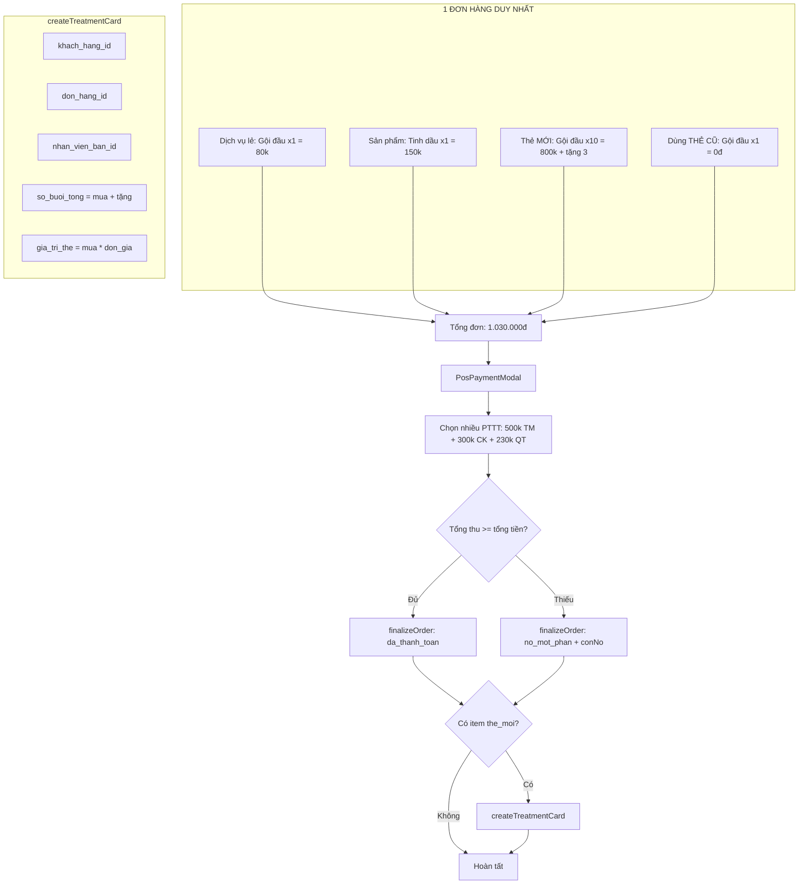

# Kế Hoạch Sửa Lỗi POS — HSMS

> **Kiến trúc:** GỘP CHUNG 1 đơn hàng (như myspa.vn)
> - Bán lẻ + Mua thẻ mới + Dùng thẻ cũ + Sản phẩm → **1 đơn hàng duy nhất**
> - 1 lần thanh toán (đa phương thức)
> - Sau khi chốt đơn → tự động tạo `the_lieu_trinh` nếu có mua thẻ mới

---

## Phân Tích Database Hiện Tại

### 🟢 ĐÃ HỖ TRỢ (chỉ cần frontend)

| Tính năng | DB | Trạng thái |
|-----------|-----|-----------|
| Đa phương thức thanh toán | `thanh_toan` — nhiều row/1 đơn, hỗ trợ `tien_mat`, `chuyen_khoan`, `quet_the` | ✅ Cần kết nối UI |
| Công nợ (trả thiếu) | `don_hang.con_no` + `don_hang.trang_thai='no_mot_phan'` | ✅ Cần kết nối UI |
| Dùng thẻ cũ trong đơn | `don_hang_chi_tiet.the_lieu_trinh_id` + `loai_item='the_lieu_trinh'` | ✅ Đã có |
| Hủy đơn | `posService.voidOrder()` đã có RPC | ✅ Sẵn sàng |
| Chốt đơn với công nợ | `posService.finalizeOrder()` đã có param `conNo` | ✅ Sẵn sàng |
| Line item có hoa hồng | `don_hang_chi_tiet` có `nhan_vien_id`, `ti_le_hoa_hong`, `tien_hoa_hong` | ✅ Sẵn sàng |

### 🟡 CẦN THÊM DB

| Thay đổi | Lý do |
|----------|-------|
| `ALTER TABLE don_hang_chi_tiet` — thêm `loai_item='the_moi'` | Phân biệt mua thẻ mới (tính tiền) vs dùng thẻ cũ (0đ) |
| `ALTER TABLE the_lieu_trinh ADD COLUMN don_hang_id` | Gắn thẻ với đơn hàng đã mua (truy xuất nguồn gốc) |
| `ALTER TABLE the_lieu_trinh ADD COLUMN nhan_vien_ban_id` | Ghi nhận KTV bán thẻ để tính hoa hồng |
| `ALTER TABLE dich_vu ADD COLUMN promotion_config jsonb` | Lưu cấu hình "mua X tặng Y" cho từng dịch vụ |

---

## 6 Vấn Đề & Giải Pháp Chi Tiết

### Vấn Đề 1: Khách Lẻ không được mua Thẻ Liệu Trình

**Hiện tại:** [`handleCreateGuest`](src/apps/pos/PosApp.jsx:529) cho phép tạo khách không có SĐT.

**Sửa:**
1. [`handleCreateGuest`](src/apps/pos/PosApp.jsx:529) → Validate `guestPhone` không được trống
2. [`PosProductCatalog`](src/apps/pos/PosProductCatalog.jsx:60) → Nhận prop `isGuest`, nếu `true`:
   - Ẩn tab "Mua thẻ mới"
   - Ẩn tab "Thẻ dịch vụ" (dùng thẻ cũ)
3. `pickCustomer` → Khi chọn khách cũ → hiển thị đầy đủ tabs

---

### Vấn Đề 2: Mua Thẻ Liệu Trình mới — thiếu flow

**Hiện tại:** Tab "Thẻ dịch vụ" chỉ hiển thị thẻ **đã có sẵn** để dùng buổi.

**Yêu cầu:** Flow mua thẻ mới trong catalog → thêm vào GIỎ HÀNG CHUNG:
1. Tab "Mua thẻ mới" trong [`PosProductCatalog`](src/apps/pos/PosProductCatalog.jsx)
2. Chọn dịch vụ → popup nhập số lượng + promotion
3. Thêm vào giỏ với `loai_item='the_moi'`, giá = số_lượng × đơn_giá
4. Sau thanh toán → tạo `the_lieu_trinh` tự động

**Các bước:**
1. Thêm tab `type='the_moi'` trong [`PosProductCatalog`](src/apps/pos/PosProductCatalog.jsx:60)
2. Khi click service → mở popup [`BuyCardPopup`](src/apps/pos/PosApp.jsx:0) (state `buyCardService`)
3. Popup: input số lượng, hiển thị promotion (mua X tặng Y), hiển thị tổng tiền
4. [`handleBuyCard`](src/apps/pos/PosApp.jsx:555): 
   - `loai_item='the_moi'`, `dich_vu_id`, `so_luong`, `don_gia=gia_co_ban`, `thanh_tien=so_luong*gia_co_ban`
   - `ghi_chu` = JSON: `{promotion: {mua:10, tang:3}, tong_buoi:13}`
   - `nhan_vien_id` = KTV bán (chọn từ popup)
5. Sau [`finalizeOrder`](src/apps/pos/PosApp.jsx:555) → nếu có item `the_moi`:
   - Gọi `posService.createTreatmentCard()` để tạo record

---

### Vấn Đề 3: Khuyến mãi "mua X tặng Y"

**Hiện tại:** Chưa có.

**Giải pháp:** Thêm cột `promotion_config JSONB` vào [`dich_vu`](src/services/posService.js):
```json
{
  "loai": "mua_tang",
  "so_luong_mua": 10,
  "so_luong_tang": 3,
  "mota": "Mua 10 tặng 3"
}
```

**Sửa frontend:**
- [`BuyCardPopup`](src/apps/pos/PosApp.jsx:0): Đọc `promotion_config` từ service, tự động tính số tặng
- [`CartLine`](src/apps/pos/PosCart.jsx:217): Hiển thị "Mua 10 + Tặng 3 = 13 buổi"
- Khi tạo `the_lieu_trinh`: `so_buoi_tong = so_luong_mua + so_luong_tang`

---

### Vấn Đề 4: Sai giá hiển thị

**Hiện tại:** [`handleAddCard`](src/apps/pos/PosApp.jsx:491) set `don_gia: 0, thanh_tien: 0` (dành cho dùng thẻ cũ).

**Giải pháp:**
- [`handleAddCard`](src/apps/pos/PosApp.jsx:491) — giữ nguyên (dùng thẻ cũ, giá=0)
- [`handleBuyCard`](src/apps/pos/PosApp.jsx:555) — mới (mua thẻ mới, giá = số_lượng × đơn_giá)
- 2 flow riêng, không ảnh hưởng nhau

---

### Vấn Đề 5: Thanh toán đa phương thức

**Hiện tại:** [`handleCheckout`](src/apps/pos/PosApp.jsx:555) chỉ 1 PTTT.

**Sửa:**
1. Bỏ `handleCheckout` cũ
2. Khi bấm "Thanh toán" → mở [`PosPaymentModal`](src/apps/pos/PosPaymentModal.jsx:66) (đã có sẵn)
3. [`PosPaymentModal.onConfirm(payments[])`](src/apps/pos/PosPaymentModal.jsx:78):
   - Loop `addPayment(orderId, payment)` cho từng hình thức
   - Tính `totalPaid`, `conNo = tongCuoi - totalPaid`
   - `finalizeOrder(orderId, { conNo })`
   - Nếu `conNo > 0` → tự động set `trang_thai='no_mot_phan'`

---

### Vấn Đề 6: Công nợ (trả thiếu)

**Hiện tại:** Chưa hỗ trợ trong UI.

**Sửa:**
- [`PosPaymentModal`](src/apps/pos/PosPaymentModal.jsx:66) — đã có logic ghi nợ
- Cho phép nợ nếu `selectedCustomer` là khách đã đăng ký (có `id`)
- Guest → bắt buộc trả đủ
- Sau thanh toán: hiển thị công nợ trên đơn hàng

---

## Kế Hoạch Thực Hiện Chi Tiết

### Bước 1: Database Migration
```sql
-- 1. Thêm loại item 'the_moi' cho đơn hàng chi tiết
ALTER TABLE don_hang_chi_tiet 
  DROP CONSTRAINT IF EXISTS don_hang_chi_tiet_loai_item_check;
ALTER TABLE don_hang_chi_tiet 
  ADD CONSTRAINT don_hang_chi_tiet_loai_item_check 
    CHECK (loai_item IN ('dich_vu','san_pham','the_lieu_trinh','the_moi'));

-- 2. Thêm cột cho the_lieu_trinh
ALTER TABLE the_lieu_trinh 
  ADD COLUMN IF NOT EXISTS don_hang_id uuid REFERENCES don_hang(id) ON DELETE SET NULL,
  ADD COLUMN IF NOT EXISTS nhan_vien_ban_id uuid REFERENCES nhan_vien(id) ON DELETE SET NULL;

-- 3. Promotion config cho dịch vụ
ALTER TABLE dich_vu 
  ADD COLUMN IF NOT EXISTS promotion_config jsonb DEFAULT null;

-- 4. Seed promotion mẫu
UPDATE dich_vu 
SET promotion_config = '{"loai":"mua_tang","so_luong_mua":10,"so_luong_tang":3,"mota":"Mua 10 tặng 3"}'
WHERE ten ILIKE '%gội đầu%' OR ten ILIKE '%massage%';
```

### Bước 2: posService.js — Thêm API
1. [`createTreatmentCard`](src/services/posService.js) — tạo record `the_lieu_trinh` mới
   - `{ khachHangId, donHangId, dichVuId, tenDichVu, soBuoiMua, soBuoiTang, giaTri, nhanVienBanId }`
   - `so_buoi_tong = soBuoiMua + soBuoiTang`
   - `gia_tri_the = soBuoiMua * donGia` (chỉ tính tiền số buổi mua, không tính buổi tặng)
2. `getServicesForCards()` — lấy `dich_vu` có `is_active=true` và `la_phu_thu=false`

### Bước 3: PosProductCatalog.jsx — Thêm tab "Mua thẻ mới"
1. Thêm tab `type='the_moi'` với label "Mua thẻ mới"
2. Hiển thị danh sách dịch vụ (từ `getServicesForCards`)
3. Click → gọi `onAddItem({ loai_item:'the_moi', dich_vu_id, ... })` 
   - Hoặc mở popup `BuyCardPopup` nếu cần nhập số lượng

### Bước 4: PosApp.jsx — Sửa flow chính
**State mới:**
```js
const [showPaymentModal, setShowPaymentModal] = useState(false)
const [buyCardService, setBuyCardService] = useState(null) // { dich_vu, so_luong, promotion }
```

**Handlers mới/sửa:**
1. [`handleCreateGuest`](src/apps/pos/PosApp.jsx:529) — validate SĐT không trống
2. `handleBuyCard(dichVu, soLuong, promotion, nhanVienBan)` — thêm line item với `loai_item='the_moi'`
3. `handleCheckout` mới → `setShowPaymentModal(true)`
4. `handlePaymentConfirm(payments[])`:
   ```js
   // 1. Gọi addPayment cho từng hình thức
   for (const p of payments) {
     await posService.addPayment(orderId, { hinhThuc: p.hinhThuc, soTien: p.soTien })
   }
   // 2. Tính conNo
   const totalPaid = payments.reduce((s,p) => s + p.soTien, 0)
   const conNo = Math.max(0, tongCuoi - totalPaid)
   // 3. finalizeOrder
   await posService.finalizeOrder(orderId, { conNo })
   // 4. Nếu có mua thẻ mới → tạo the_lieu_trinh
   const buyCardItems = lineItems.filter(i => i.loai_item === 'the_moi')
   for (const item of buyCardItems) {
     const promo = JSON.parse(item.ghi_chu || '{}')
     await posService.createTreatmentCard({
       khachHangId: selectedCustomer.id,
       donHangId: orderId,
       dichVuId: item.dich_vu_id,
       tenDichVu: item.dich_vu?.ten || 'Thẻ dịch vụ',
       soBuoiMua: item.so_luong,
       soBuoiTang: promo.promotion?.tang || 0,
       giaTri: item.thanh_tien,
       nhanVienBanId: item.nhan_vien_id,
     })
   }
   // 5. Reset + thông báo
   ```

### Bước 5: PosCart.jsx — Hiển thị promotion
- Nếu item có `loai_item='the_moi'` và `ghi_chu` chứa promotion:
  - Hiển thị "Mua X + Tặng Y = Z buổi"
  - Hiển thị giá = so_luong × don_gia

### Bước 6: PosPaymentModal.jsx — Đã hoàn chỉnh, không cần sửa
- Props: `tongHang`, `selectedCustomer`, `onConfirm(payments)`, `onCancel`
- Logic nợ đã có: nếu customer có `id` → cho phép trả thiếu

---

## Kiến Trúc Flow Mới



---

## Files Cần Sửa

| File | Thay đổi |
|------|----------|
| **DB Migration** | ALTER 3 tables (don_hang_chi_tiet, the_lieu_trinh, dich_vu) |
| [`src/services/posService.js`](src/services/posService.js) | Thêm `createTreatmentCard()`, `getServicesForCards()` |
| [`src/apps/pos/PosProductCatalog.jsx`](src/apps/pos/PosProductCatalog.jsx) | Thêm tab "Mua thẻ mới", ẩn tab khi Guest |
| [`src/apps/pos/PosApp.jsx`](src/apps/pos/PosApp.jsx) | Sửa flow: validate Guest, `handleBuyCard`, kết nối PaymentModal, xử lý đa phương thức + công nợ + tạo thẻ |
| [`src/apps/pos/PosCart.jsx`](src/apps/pos/PosCart.jsx) | Hiển thị promotion info cho item `the_moi` |
| [`src/apps/pos/PosPaymentModal.jsx`](src/apps/pos/PosPaymentModal.jsx) | **Không cần sửa** (đã hoàn chỉnh) |

---

## Rủi Ro & Lưu Ý

1. **`handleCheckout` cũ (dòng 555-576)** sẽ bị thay thế → xóa hoặc comment
2. **`pttt` state + `nhapTien` state** (dòng 444) không còn dùng → có thể xóa
3. **Phân biệt KTV bán thẻ vs KTV thực hiện:**
   - Bán thẻ → `nhan_vien_id` trong line item `the_moi`
   - Thực hiện dịch vụ → `nhan_vien_id` trong line item `dich_vu`
   - Sau này khi tính lương: cần phân biệt 2 loại hoa hồng
4. **Promotion config** là seed tĩnh ban đầu → sau này có thể làm GUI quản lý
5. **Guest không được nợ** → chỉ khách đã đăng ký mới được ghi nợ
